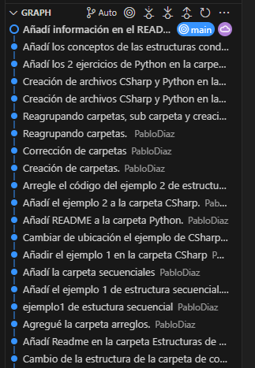
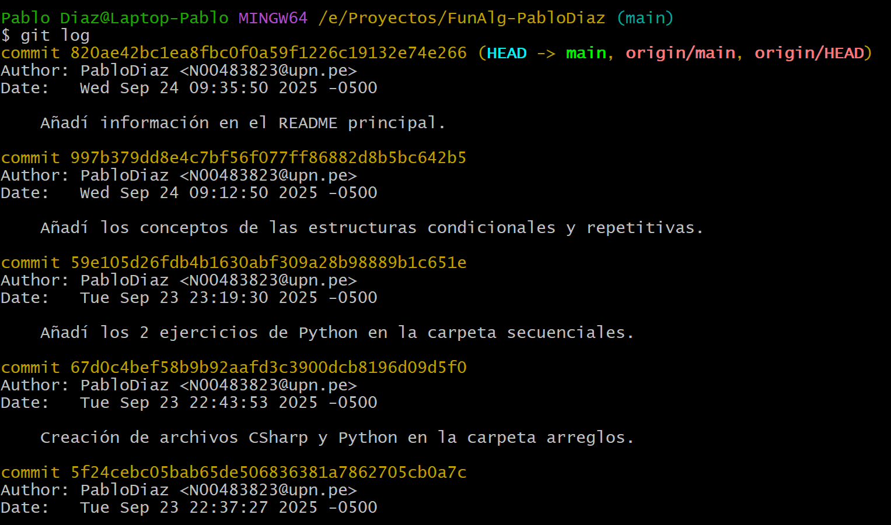

# Trabajo Colaborativo con GIT

---

## ¿Por qué usar control de versiones en colaboración?

- Evita sobrescribir los cambios de otras personas.
- Permite que varios desarrolladores trabajen en el mismo proyecto al mismo tiempo.
- Simplifica la integración y el manejo de grandes proyectos.

## Herramientas para repositorios remotos más comunes:

- GitHub, GitLab, y Bitbucket son plataformas esenciales para el trabajo en equipo.
- Crear un repositorio remoto y luego usar git clone para trabajar en él localmente.

# Comandos Esenciales para la Colaboración.

### Conectando un repositorio local con un remoto:

- git remote add origin [URL] del repositorio

### Subiendo cambios al repositorio remoto.

- git push origin main

### Obteniendo cambios del repositorio remoto:

- git pull origin  main

### Trabajando con ramas de forma remota:

- git branch -r → Listar ramas remotas.
- git push -u origin monbre de la rama → Subir una nueva rama.
- git fetch → Descargar todas las ramas remotas.

# Resolución de Conflictos

## ¿Que es un conflicto en Git?

- Ocurre cuando dos versiones del código modifican la misma línea.
- Git no puede decidir automáticamente qué versión es correcta.

## Pasos para resolver un conflicto.

1. Identificar el conflicto con git status.
2. Abrir el archivo en conflicto y revisar las diferencias (<<<<<<, =======, >>>>>>).
3. Editar el código para mantener la versión correcta.
4. Confirmar los cambios.

## Comandos 

- git add archivo-afectado
- git add archivo-afectado

# Buenas Prácticas para la Colaboración

## Estrategias clave para colaborar con Git:

- Uso de ramas para cada funcionalidad o corrección.
- Evitar commits sin descripción clara.
- Actualizar el repositorio antes de hacer cambios (git pull).
- Revisar cambios antes de fusionar (git diff).
- Uso de git stash para guardar cambios temporales.
- Hacer revisiones de código con Pull Requests (PR).

## Flujo de trabajo recomendado:

1. Crear una nueva rama para cada funcionalidad.
2. Crear una nueva rama para cada funcionalidad.
3. Subir cambios a la rama remota.
4. Revisar el código antes de fusionar con main.
5. Resolver posibles conflictos antes de integrar cambios.

## Capturas de commits, logs o flujo de ramas:

1. Commits:

La siguiente imagen muestra un historial de commits.

()

2. Logs:

La siguiente captura de la terminal muestra el historial detallado de los commits del proyecto.

---